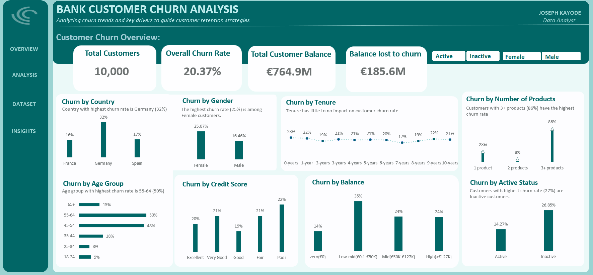
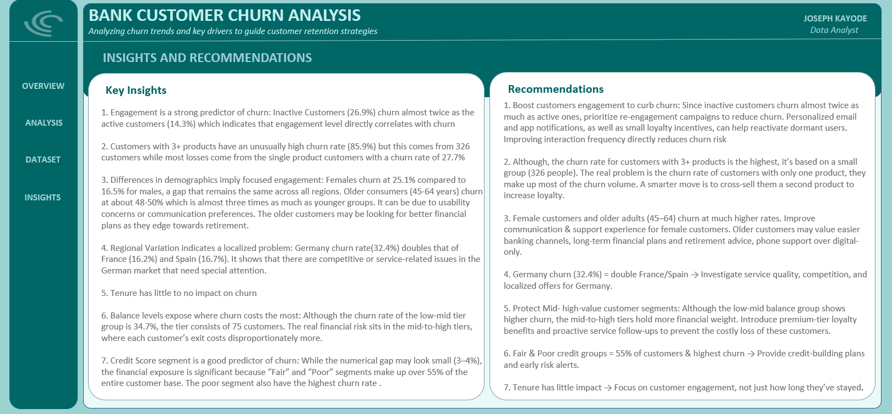

Use this **final, clean README**. It includes everything: refined insights, correct visuals, and dashboard interaction section.

---

# 📊 Bank Customer Churn Analysis (Excel + Power Query + Power Pivot)

## 📌 Overview

This project analyzes bank customer churn using Excel, focusing on identifying key drivers of churn and providing actionable insights to improve customer retention.

The analysis combines **Power Query for data preparation**, **Power Pivot for modeling**, and **interactive dashboards** for visualization.

---

## 🧰 Tools Used

* Microsoft Excel
* Power Query (data cleaning and transformation)
* Power Pivot (data modeling and aggregation)
* Pivot Tables & Charts
* Slicers (interactive filtering)

---

## 📂 Dataset

* Source: Bank Customer Churn dataset (Kaggle)
* Records: **10,000 customers**

Features include:

* Demographics (Age, Gender, Geography)
* Account information (Balance, Tenure, Products)
* Activity status
* Credit score
* Churn indicator

---

## 🔍 Data Preparation

Data was prepared using **Power Query and Power Pivot** to ensure it was structured for analysis.

Key steps included:

* Validating and standardizing data types
* Structuring the dataset for Power Pivot and pivot-based analysis
* Creating derived fields for segmentation:

  * Age groups
  * Balance segments
  * Credit score categories
* Organizing fields for aggregation and dashboard visualization
* Ensuring consistency across categorical variables

---

## 📊 Key Metrics

* Total Customers: **10,000**
* Overall Churn Rate: **20.37%**
* Total Customer Balance: **€764.9M**
* Balance Lost to Churn: **€185.6M**

---

## 📊 Dashboard Features

The dashboard includes interactive slicers for:

* Customer Activity (Active vs Inactive)
* Gender

Key visualizations:

* Churn by Geography
* Churn by Gender
* Churn by Age Group
* Churn by Credit Score
* Churn by Balance Segment
* Churn by Number of Products
* Churn by Activity Status
* Churn vs Tenure

---

## 📊 Visuals

### Dashboard Overview



---

### Insights & Recommendations



---

## 🧠 Key Insights

* Churn rate is **20.37%** (≈ 1 in 5 customers leave)

### Customer Activity

* Inactive: **26.9% churn**
* Active: **14.3% churn**
  → Engagement is a major driver

---

### Product Ownership

* 3+ products: **~86% churn (small segment)**
* 1 product: **~28% churn (largest impact)**

---

### Demographics

* Female: **25.1% churn**
* Male: **16.5% churn**
* Age 45–64: **~48–50% churn (highest)**

---

### Geography

* Germany: **~32% churn**
* France/Spain: **~16–17%**

---

### Credit Score

* Lower scores: **~22% churn vs ~19–21%**

---

### Balance Impact

* Mid–high balance customers carry **highest financial risk**

---

### Tenure

* Minimal variation (**~17–23%**) → weak driver

---

## 💡 Recommendations

1. Increase engagement for inactive users
2. Focus on 1-product customers (cross-sell early)
3. Target high-risk segments (female, 45–64)
4. Investigate high churn in Germany
5. Protect high-value (high balance) customers

---

## 🧩 Dashboard Interaction

The dashboard is fully interactive using slicers in Excel.

To explore:

1. Download the Excel file from the `dashboard` churn_dashboardAnalysis.xlsx file
2. Open in Microsoft Excel
3. Use slicers to filter by:

   * Customer Activity
   * Gender

The slicers dynamically update all charts to reveal churn patterns across segments.

---

## 📁 Project Structure

```text
bank-churn-excel-analysis/
├── data/
│   └── churn_modelling.csv
├── dashboard/
│   └── churn_dashboardAnalysis.xlsx
├── visuals/
│   ├── dashboard_overview.png
│   └── insights.png
└── README.md
```

---

## 🚀 Conclusion

Churn is primarily driven by **customer inactivity, demographics, and product engagement**, rather than tenure.

Retention efforts should focus on:

* improving engagement
* increasing product adoption
* protecting high-value customers

